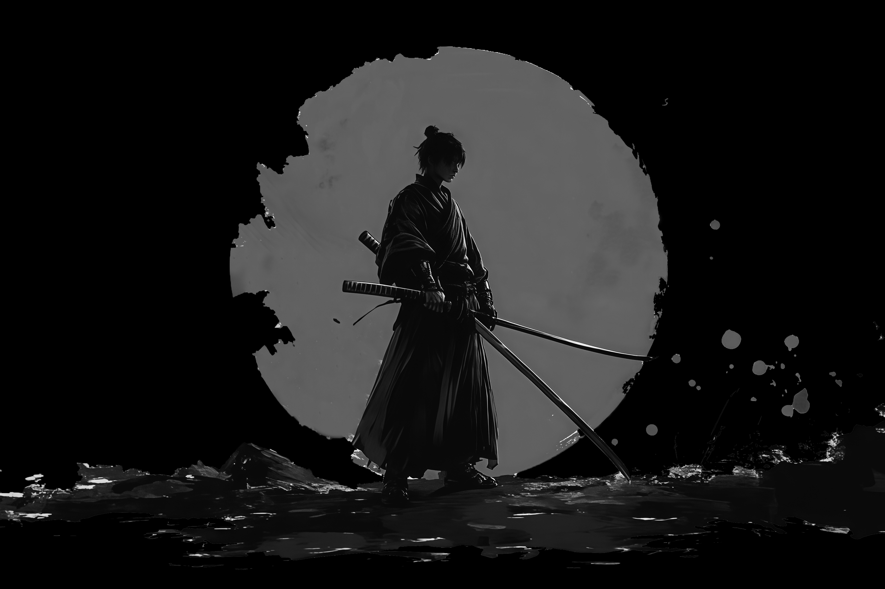

# ONYXDEV - Modern Web Development Portfolio



## Project Overview

ONYXDEV is a modern, sleek portfolio website built with Next.js, featuring a dark-themed design with red accents. The site showcases a minimalist aesthetic with glassmorphism effects and smooth animations.

## Technology Stack

- **Framework**: Next.js 15.4.5 with App Router
- **Language**: TypeScript
- **Styling**: CSS Modules + Tailwind CSS
- **Deployment**: Ready for Vercel deployment

## Project Structure

```
├── public/
│   ├── fonts/
│   │   ├── MARTI.otf
│   │   └── MARTI-Rounded.otf
│   └── images/
│       ├── background.jpg
│       ├── navbar-glass.svg
│       └── samurai.png
├── src/
│   ├── app/
│   │   ├── globals.css
│   │   ├── layout.tsx
│   │   └── page.tsx
│   ├── components/
│   │   ├── Header.tsx
│   │   ├── Home.tsx
│   │   ├── Navbar.tsx
│   │   └── Tagline.tsx
│   └── styles/
│       ├── Header.module.css
│       ├── Home.module.css
│       ├── Navbar.module.css
│       └── Tagline.module.css
```

## Design Elements

### Fonts

- **MARTI**: Custom font used for the logo and headings
  - Regular: `/fonts/MARTI.otf`
  - Rounded (Bold): `/fonts/MARTI-Rounded.otf`
- **Lexend**: Google Font used for navigation and body text
  - Weights: 300, 400, 500, 600

### Color Scheme

- **Primary**: #A10000 (Deep Red)
- **Background**: #000000 (Black)
- **Text**: #FFFFFF (White)
- **Accents**: #ff3333, #ff0055 (Bright Red variants)

### UI Components

#### Header
- Sticky header with logo and tagline
- Changes opacity on scroll
- Logo uses MARTI font with red coloring

#### Navbar
- Fixed position with glassmorphism effect
- Responsive menu with hamburger toggle for mobile
- Hover effects with red underline animation
- Navigation links: Home, About Us, Projects, Contact

#### Tagline
- "// Designed in Darkness //" tagline
- Live IST (Indian Standard Time) clock with flip animation
- Custom styling for time digits

#### Home
- Main content area (currently a placeholder for future content)

### Special Effects

- **Glassmorphism**: Used in the navbar and container elements
- **Gradient Borders**: Subtle light gradients on container edges
- **Animations**: 
  - Flip animation for clock digits
  - Hover effects on navigation links
  - Fade-in animations for components

## Recent Updates

- Fixed 'About Us' text to display on a single line using non-breaking space
- Modified active link styling to only show red color on hover instead of by default
- Fixed Navbar active link styling to dynamically highlight based on current page path
- Removed hardcoded red color from Home link and made all links consistent
- Updated Navbar to float at the top center of the Header section with absolute positioning
- Added sticky behavior to Navbar that activates on scroll with smooth transitions
- Enhanced glassmorphism effect with increased border-radius and subtle shadows
- Implemented smooth scrolling behavior for the entire page
- Improved active link styling with red highlights and underline effects
- Ensured responsive design for the floating Navbar on all device sizes
- Updated Navbar design to match the new compact style with 'Home' as the active link
- Simplified Navbar structure by removing the outer container div
- Applied glassmorphism effects directly to the navigation list
- Rearranged layout structure: moved Navbar above Header for better UI organization
- Fixed Navbar visibility issues by changing its positioning from fixed to relative
- Added Documentation Maintenance guidelines for all developers and AI assistants
- Implemented the IST clock with flip animation in the Tagline component
- Added glassmorphism effects to the navbar
- Created responsive design for mobile devices
- Set up custom font integration

## Getting Started

1. Clone the repository
2. Install dependencies:
   ```bash
   npm install
   ```
3. Run the development server:
   ```bash
   npm run dev --turbopack
   ```
4. Open [http://localhost:3000](http://localhost:3000) in your browser

## Development Notes

- The project uses CSS Modules for component-specific styling
- Tailwind CSS is configured for utility classes
- Custom fonts are loaded in `globals.css` and configured in `tailwind.config.js`
- The site is designed to be fully responsive across all device sizes

## Documentation Maintenance

**IMPORTANT FOR ALL DEVELOPERS AND AI ASSISTANTS:**

Whenever you make changes to this project, you MUST update this README.md file to reflect those changes. This includes:

- Adding new features to the Recent Updates section
- Updating the Project Structure if files are added or removed
- Documenting any new components, styling approaches, or dependencies
- Explaining any architectural changes

This ensures that anyone (human or AI) who works on this project in the future will have accurate and up-to-date documentation to understand the current state of the project.

## Future Enhancements

- Complete the Home component with portfolio content
- Implement About, Projects, and Contact pages
- Add animations for page transitions
- Implement dark/light theme toggle
- Add internationalization support

## License

This project is proprietary and not licensed for public use without permission.

---

© 2023 ONYXDEV. All rights reserved.
